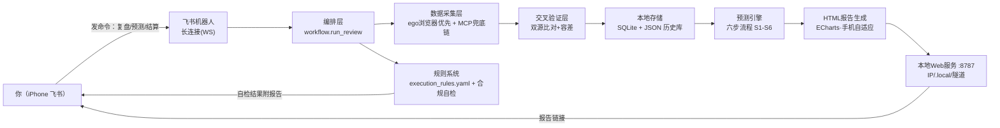

# A股复盘预测系统 · 架构设计方案（定稿）

> 文档编号：ARCH-001 ｜ 版本：v1.0（定稿）｜ 关联：REQ-001
> 说明：本文档为完整上下文讨论后**定稿**的架构方案，作为工程实现依据。

## 1. 总体架构



## 2. 组件职责

| 组件 | 职责 | 关键文件 |
|---|---|---|
| 飞书机器人 | 长连接收命令、发卡片 | app/feishu/bot.py |
| 编排层 | 复盘+预测+跟踪一体流程 | app/workflow.py |
| 数据采集 | ego 抓东财公开数据（多域名兜底） | app/ego_scraper.py, app/predict/alt_data.py |
| MCP 客户端 | WorkBuddy 代理自动发现端口/token | app/mcp_client.py |
| 交叉验证 | 双源容差校验 | app/validator.py |
| 候选池 | 强势板块→板块内个股+资金活跃 | app/predict/candidate_pool.py |
| 规则打分 | 技术/资金/情绪面打分 | app/predict/scoring.py |
| 消息面 | 公告/新闻/事件/龙虎榜扫描 | app/predict/news.py |
| LLM研判 | DeepSeek 输出3只+买卖计划 | app/predict/judge.py, llm.py |
| 跟踪评估 | 昨日标的次日结算+命中率 | app/predict/track.py |
| 规则系统 | 规则加载+合规自检 | app/rules.py |
| Web服务 | 手机访问报告 | app/server.py |

## 3. 数据源兜底顺序（定稿）
按数据类型固定（config/config.yaml mcp.sources）：
- 行情（指数/个股/K线）：通达信 → 同舟 → Wind
- 资金（资金流/龙虎榜/北向）：Wind → 通达信 → 同舟
- 研究（研报/消息面）：同舟 → Wind → 通达信
- 网页抓取：东财 push2delay（备用域名）优先，push2 兜底；MCP 全挂时上报用户审查

## 4. 预测六步核心算法（定稿，规则 R21–R26）

```
S1 7-10日强势板块筛选 ──▶ S2 板块内强势股+全市场资金活跃候选池
S2 ──▶ S3 规则打分（技术面+资金面+情绪面）
S3 ──▶ S4 消息面扫描（公告/新闻/龙虎榜）
S4 ──▶ S5 LLM综合研判：出3只 + 买卖计划
S5 ──▶ S6 回测验证（历史N日命中率）
```

## 5. 关键设计决策（定稿记录）

| # | 决策 | 理由/结论 |
|---|---|---|
| D1 | 同日预测**锁定复用** | 保证"用户看到的=结算的"，避免 LLM 非确定性导致标的漂移 |
| D2 | 报告**完整才允许复用**（板块+预测+跟踪） | 防止坏报告被同日缓存复用 |
| D3 | 消息级+回复级**去重** | 防飞书长连接重投导致重复输出/浪费 token |
| D4 | 报告链接：**IP 主按钮 + .local 备用 + 当前IP提示** | 网络 IP 漂移 + mDNS 不确定性下的可靠访问 |
| D5 | 结算**开盘+收盘双口径** | 规则卖点是"次日开盘"，同时展示持有到收盘的参考 |
| D6 | MCP 代理**自动发现端口/token** | WorkBuddy 重启后端口变化（55056→56555），写死会失联 |
| D7 | 东财**push2delay 备用域名** | 主域名限流时保证板块/资金流/K线可获取 |
| D8 | 规则系统作为**核心算法约束** | 需求不靠对话记忆，靠 execution_rules.yaml + 合规自检强制 |
| D9 | 假设库独立管理（hypothesis 状态） | 投资经验先验证后纳入，不直接进策略 |

## 6. 后台服务（launchd 常驻）
| 服务 | 作用 |
|---|---|
| com.ashare.bot | 飞书机器人长连接 |
| com.ashare.server | 报告 Web 服务 :8787 |
| com.ashare.settle | 工作日 15:30 自动结算 |
| com.ashare.caffeinate | 防休眠（插电合盖运行） |

## 7. 版本与变更
- 原始需求基线：docs/需求规格说明书.md（REQ-001 v1.0）
- 架构基线：本文档（ARCH-001 v1.0）
- 执行规则：execution_rules.yaml / RULES.md
- 变更流程：用户新要求 → 更新 REQ/ARCH/规则 → git 提交 → 下次执行生效
